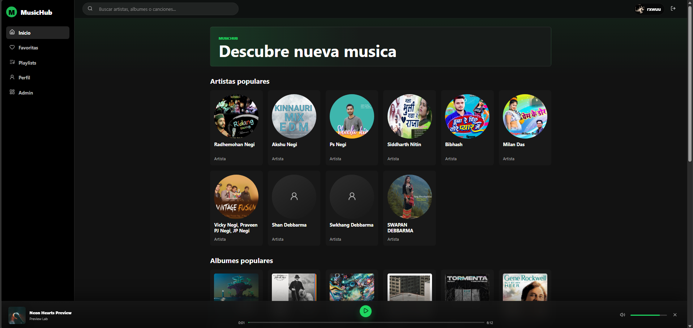
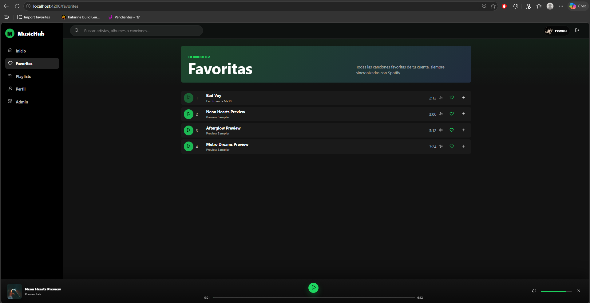
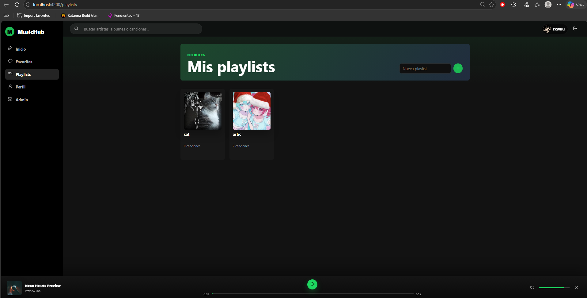
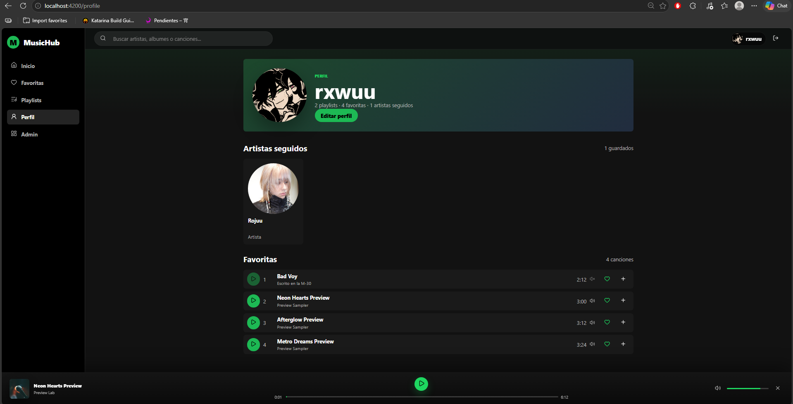
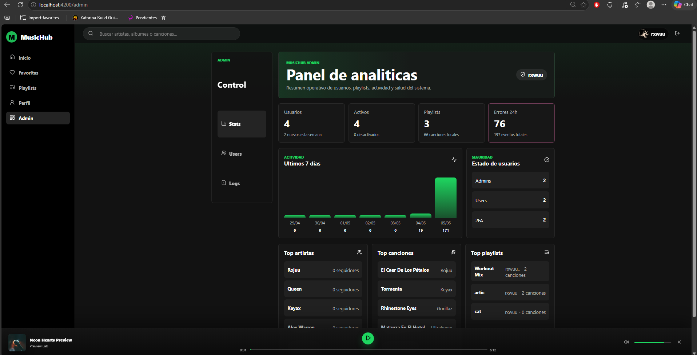

# MusicHub

MusicHub es una aplicacion web musical inspirada en Spotify. Permite explorar artistas, albumes y canciones, guardar favoritas, crear playlists persistentes, editar el perfil, reproducir previews de audio y administrar usuarios desde un panel privado.

El proyecto combina un frontend Angular con una API REST Laravel. El backend gestiona autenticacion con token, 2FA por correo configurable, persistencia en SQLite, biblioteca de usuario, eventos de actividad y panel de administracion.

# IP PROYECTO DESPLEGADO

http://213.32.19.95/
## Tecnologias

- Frontend: Angular 21, TypeScript, SCSS.
- Backend: Laravel, PHP, SQLite, Eloquent.
- Integracion musical: Spotify Web API con catalogo local de respaldo.

## Estructura

```text
backend/              API REST Laravel
frontend/             Aplicacion Angular
docs/                 Documentacion del proyecto
docs/uml/             Diagramas PlantUML
anteproyecto/         Material inicial y capturas de referencia
```

## Instalacion

Requisitos:

- PHP 8.3 o superior
- Composer
- Node.js 22 o superior
- npm

Backend:

```powershell
cd backend
composer install
copy .env.example .env
php artisan key:generate
php artisan migrate:fresh --seed
php artisan serve
```

Frontend:

```powershell
cd frontend
npm install
npm.cmd run start
```

Abre la aplicacion en:

```text
http://127.0.0.1:4200
```

## Uso basico

1. Entra con un usuario demo o registra una cuenta nueva.
2. Explora artistas, albumes y canciones desde Inicio.
3. Reproduce previews desde cualquier lista de canciones.
4. Marca canciones como favoritas.
5. Crea playlists y agrega canciones.
6. Edita tu perfil desde la seccion Perfil.
7. Accede a Admin con una cuenta administradora para gestionar usuarios, playlists, 2FA, logs y estadisticas.

## Usuarios demo

```text
Usuario: demo@musichub.local / password
Admin: admin@musichub.local / password
```

## Spotify

La aplicacion funciona con catalogo demo si no hay credenciales de Spotify. Para activar Spotify, configura:

```env
SPOTIFY_CLIENT_ID=
SPOTIFY_CLIENT_SECRET=
SPOTIFY_MARKET=ES
SPOTIFY_SEED_ARTISTS=Rosalia,Quevedo,Bad Bunny,Dua Lipa,The Weeknd
```

Despues puedes sincronizar catalogo:

```powershell
cd backend
php artisan spotify:sync-catalog
```

## Documentacion

La documentacion adicional esta en `/docs`:

- `docs/mapa-web.md`
- `docs/guia-estilos.md`
- `docs/patrones-web.md`
- `docs/uml/casos-uso.md`
- `docs/uml/*.puml`

---

# Preview de la app










