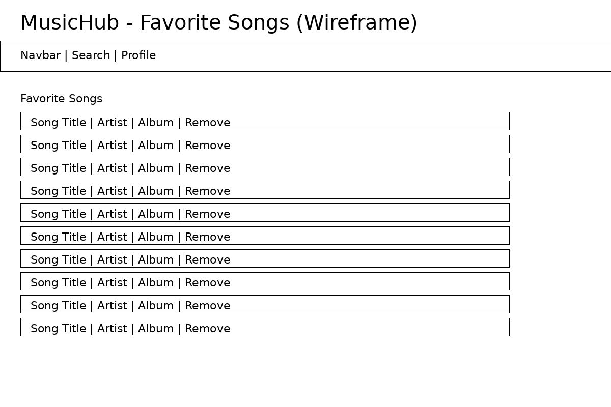
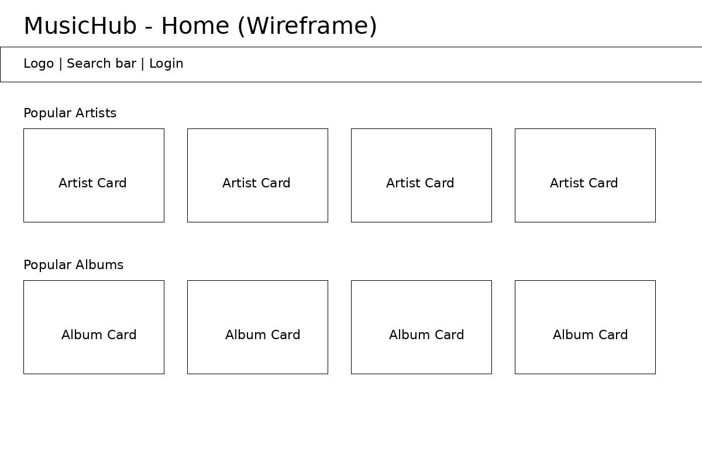
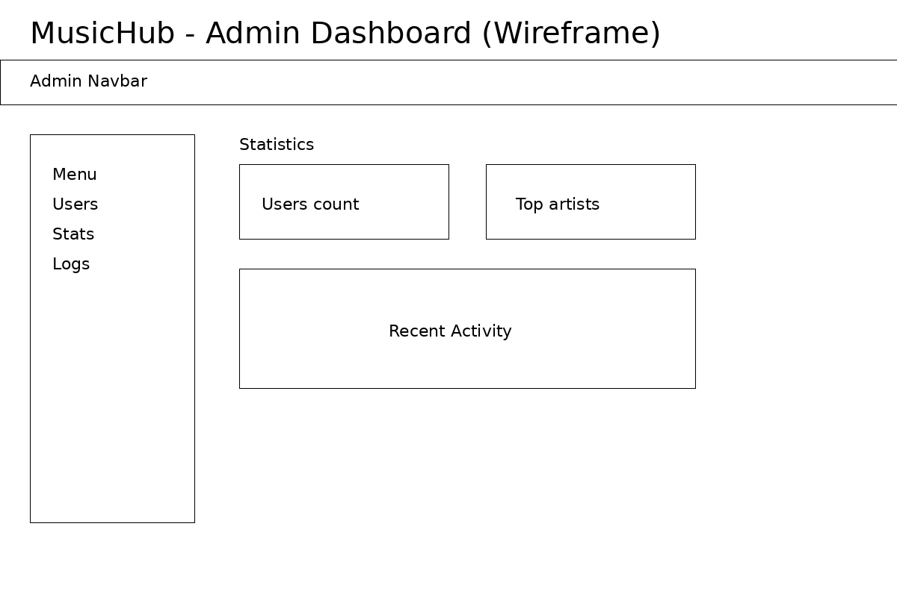
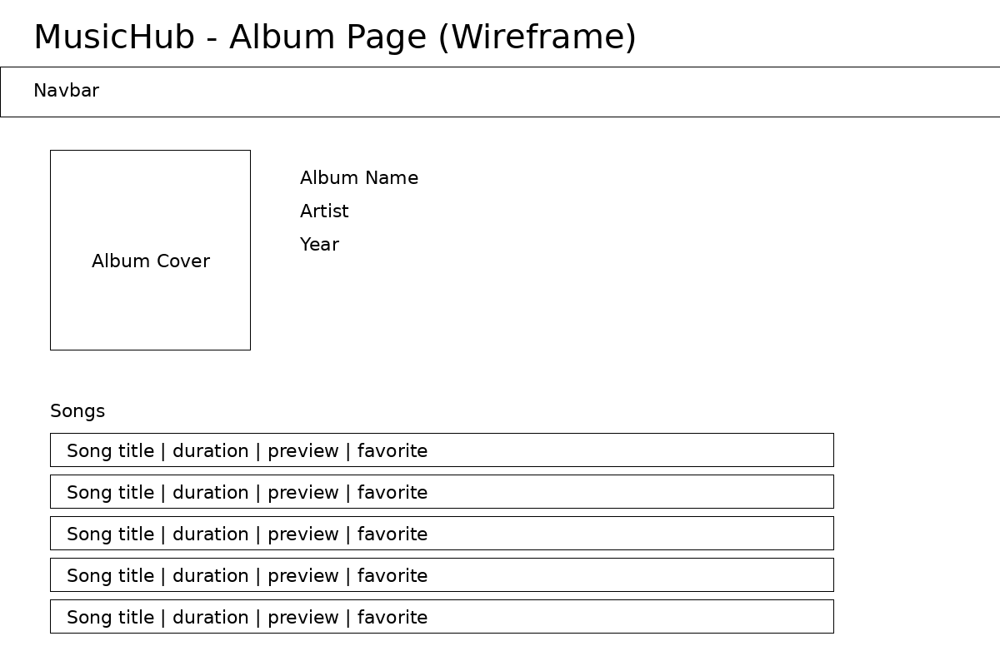
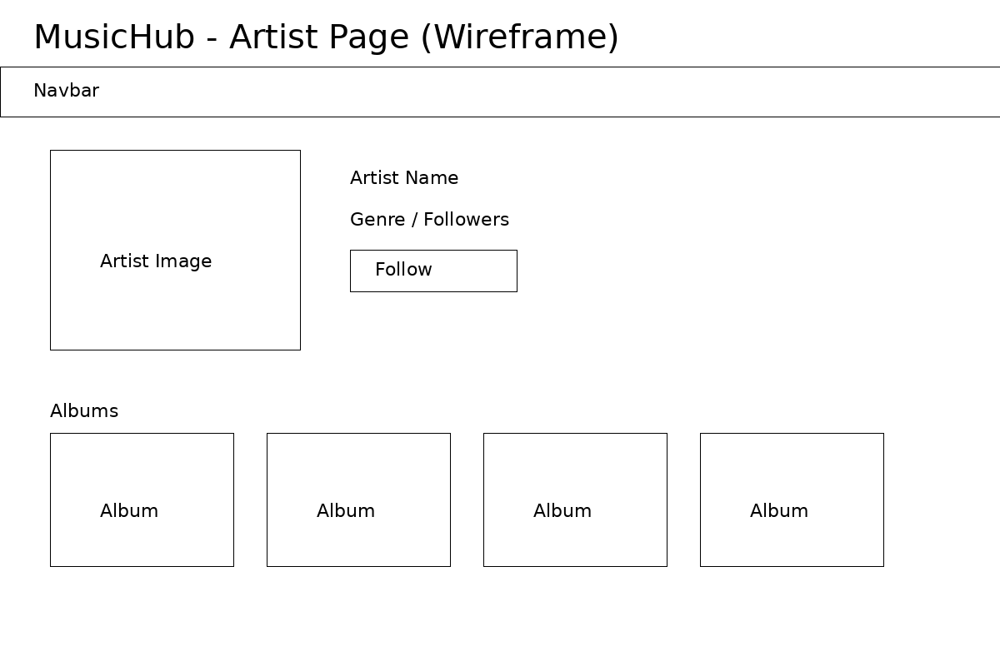
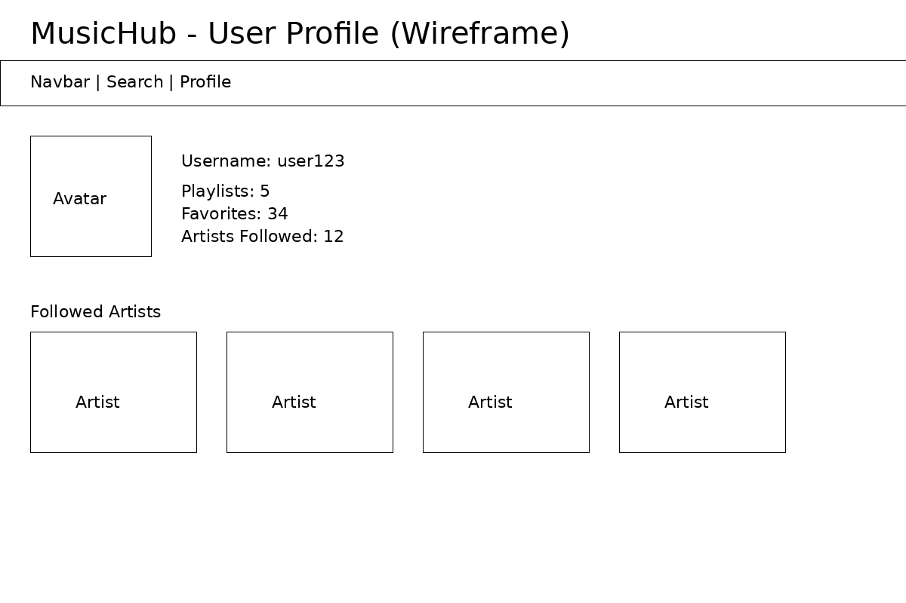
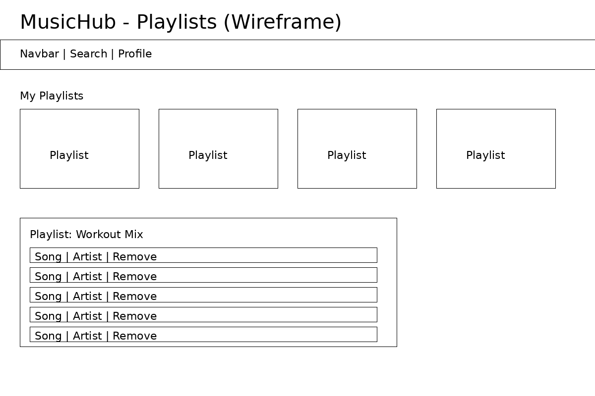

# MusicHub

## Idea

El proyecto consiste en una aplicación web centrada en la música, cuyo objetivo es permitir a los usuarios descubrir, explorar y organizar música mediante un catálogo de artistas, álbumes y canciones.

La aplicación estará dividida en dos partes principales:

### 1. Parte pública (usuarios y visitantes)

La parte pública de la aplicación permitirá a cualquier usuario (no hace falta estar autenticado) explorar el catálogo musical.

En esta sección se podrá:

* Buscar artistas
* Explorar álbumes
* Ver canciones
* Ver información básica como:

  * nombre del artista
  * álbum
  * duración de la canción
  * portada
  * preview de la canción (unos 30s)
* Navegar entre artistas, álbumes y canciones.

Los usuarios registrados, además de requerir un doble factor de autenticación al loguearse, tendránn funcionalidades adicionales:

* Crear playlists personalizadas
* Añadir canciones a favoritos
* Seguir artistas
* Ver sus playlists y canciones guardadas
* Gestionar su perfil.

El catálogo musical (artistas, álbumes y canciones) se obtendrá a través de la API Web de Spotify, mientras que las funcionalidades sociales (playlists, favoritos, comentarios, seguimiento de artistas, etc.) se almacenarán en la base de datos.

---

### 2. Panel de admin

El administrador tendrá acceso completo a todas las funcionalidades del sistema, podrá:

* Gestionar usuarios mediante un CRUD completo

  * Crear usuarios
  * Editar usuarios
  * Eliminar usuarios
  * Asignar roles
* Moderar contenido de la plataforma
* Gestionar configuraciones globales de la aplicación
* Ver estadísticas completas de uso de la plataforma.

El administrador también tendrá acceso a un panel de estadísticas, donde podrá visualizar información como:

* Número total de usuarios registrados
* Canciones más guardadas
* Artistas más seguidos
* Número de visitas a la página

---

### Historial de actividad

La aplicación incluirá también un sistema de registro de actividad, en el que se guardará información sobre acciones importantes realizadas en el sistema, como por ejemplo:

* creación o eliminación de usuarios
* eliminación de comentarios
* modificaciones en la configuración
* acciones administrativas.

Cada registro incluirá lo siguiente:

* acción realizada
* usuario que realizó la acción
* fecha y hora
* tipo de recurso afectado.

Este historial permitirá filtrar eventos por usuario o tipo de acción.

## Tecnologías usadas

### Frontend

* Angular

### Backend

* Laravel

---

# Prototipo de baja fidelidad de las funcionalidades de la app

